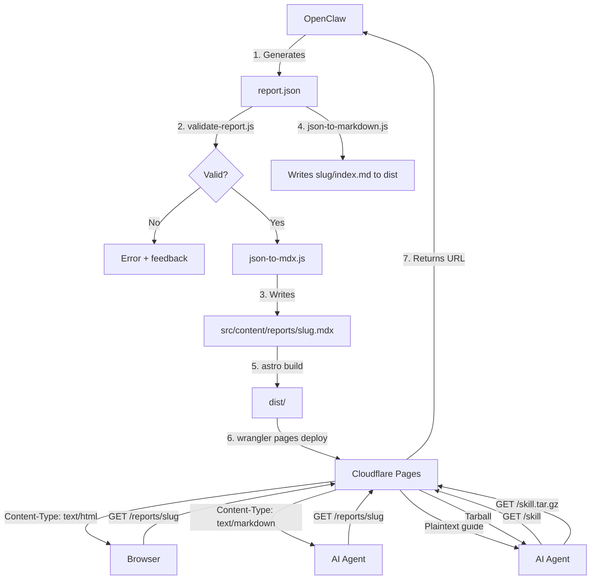

# Prism A2Report - Specification

**Version:** 2.1
**Date:** 2026-02-06

---

## 1. Project Overview

### 1.1 Objective

Build an automated pipeline that enables OpenClaw (an AI agent running locally) to generate research reports, deploy them as static websites under `prism.qnury.es`, and manage the report archive — all without manual human intervention.

### 1.2 Core Insight

This site is **AI-first**: the primary user is OpenClaw, not a human. OpenClaw conducts research, generates A2UI JSON, writes files into the local project, and calls the deployment CLI directly. The human user (Jaren) reads the final deployed reports via browser.

### 1.3 User Flow

```
OpenClaw researches topic
  → Generates report JSON (A2UI format)
  → Writes MDX into local project
  → Runs deploy CLI
  → Cloudflare Pages serves the report
  → Jaren reads it in browser or shares the URL
```

### 1.4 Success Criteria

- AI can generate and deploy reports autonomously via local CLI
- Reports are both human-readable (HTML) and AI-readable (Markdown)
- AI agents can discover capabilities via `llms.txt` and download a Skill package
- Deployment pipeline completes in < 60 seconds
- Zero recurring cost (Cloudflare free tier)
- Responsive design with excellent mobile reading experience
- Dark mode support

---

## 2. Technical Stack

| Layer              | Technology                                      |
| ------------------ | ----------------------------------------------- |
| Static Site Gen    | Astro                                           |
| Content Format     | MDX (Markdown + JSX components)                 |
| Styling            | Tailwind CSS v4 (via `@tailwindcss/vite`)       |
| Charts             | Chart.js                                        |
| Code Highlighting  | Shiki (built into Astro)                        |
| Font Optimization  | `vite-plugin-font` (powered by `cn-font-split`) |
| Deployment         | Cloudflare Pages (Direct Upload via Wrangler)   |
| Content Negotiation| Cloudflare Pages Functions                      |
| Runtime            | Node.js (via FNM) + pnpm                        |

### 2.1 Rationale

- **Astro**: Aligns with existing `qnury.es` tech stack; outputs static HTML by default
- **MDX**: LLM-friendly — AI generates Markdown naturally; JSX components add interactivity
- **Tailwind CSS v4**: Used by `qnury.es`; Vite-native plugin (`@tailwindcss/vite`) instead of PostCSS
- **Cloudflare Pages**: Free hosting, global CDN, supports Pages Functions for content negotiation
- **Wrangler Direct Upload**: Deploys pre-built `dist/` without requiring a Git-based workflow
- **vite-plugin-font**: Build-time CJK font slicing — no need to commit sliced font files to Git

---

## 3. Architecture

### 3.1 Project Directory Structure

```
prism-a2report/
├── src/
│   ├── components/
│   │   ├── Chart.astro              # Chart.js wrapper
│   │   ├── Table.astro              # Responsive table
│   │   ├── Callout.astro            # Info/warning/success/error box
│   │   └── CodeBlock.astro          # Syntax-highlighted code
│   ├── layouts/
│   │   └── ReportLayout.astro       # Standard report layout
│   ├── pages/
│   │   ├── reports/
│   │   │   └── [...slug].astro      # Dynamic report routes
│   │   └── index.astro              # Report listing page
│   ├── content/
│   │   └── reports/                 # Generated MDX files (gitignored)
│   └── styles/
│       └── global.css               # Design system tokens + prose styles
├── fonts/
│   ├── LXGWNeoXiHei.ttf            # Source font (sliced at build time)
│   └── GenRyuMin2TC.ttf             # Source font (sliced at build time)
├── scripts/
│   ├── json-to-mdx.js              # Convert A2UI JSON → MDX
│   ├── json-to-markdown.js         # Convert A2UI JSON → plain Markdown
│   ├── deploy-report.sh            # Full pipeline: validate → build → deploy
│   ├── list-reports.sh             # List deployed reports
│   └── validate-report.js          # JSON schema validation
├── schema/
│   └── report.schema.json          # A2UI report JSON schema
├── skill/
│   └── prism-report-manager/       # Agent Skill package (tarballed at build)
│       ├── SKILL.md
│       ├── scripts/
│       ├── references/
│       └── assets/
├── functions/
│   └── _middleware.ts               # Cloudflare Pages Functions (content negotiation)
├── public/
│   ├── llms.txt                     # AI discovery file
│   ├── skill                        # Plaintext skill guide (no extension)
│   └── robots.txt
├── docs/                            # Project documentation
├── astro.config.mjs
└── package.json
```

### 3.2 Data Flow



---

## 4. Report JSON Schema (A2UI Format)

### 4.1 Schema Definition

```json
{
  "$schema": "http://json-schema.org/draft-07/schema#",
  "type": "object",
  "properties": {
    "title": { "type": "string" },
    "author": { "type": "string", "default": "Prism AI" },
    "date": { "type": "string", "format": "date" },
    "slug": { "type": "string", "pattern": "^[a-z0-9-]+$" },
    "metadata": {
      "type": "object",
      "properties": {
        "tags": { "type": "array", "items": { "type": "string" } },
        "category": { "type": "string" }
      }
    },
    "sections": {
      "type": "array",
      "items": { "$ref": "#/definitions/Section" }
    }
  },
  "required": ["title", "sections"],
  "definitions": {
    "Section": {
      "oneOf": [
        { "$ref": "#/definitions/TextSection" },
        { "$ref": "#/definitions/ChartSection" },
        { "$ref": "#/definitions/TableSection" },
        { "$ref": "#/definitions/CodeSection" },
        { "$ref": "#/definitions/CalloutSection" }
      ]
    },
    "TextSection": {
      "type": "object",
      "properties": {
        "type": { "const": "text" },
        "heading": { "type": "string" },
        "level": { "type": "integer", "minimum": 1, "maximum": 6, "default": 2 },
        "content": { "type": "string", "description": "Markdown content" }
      },
      "required": ["type", "content"]
    },
    "ChartSection": {
      "type": "object",
      "properties": {
        "type": { "const": "chart" },
        "chartType": { "enum": ["line", "bar", "pie", "doughnut"] },
        "title": { "type": "string" },
        "data": { "type": "object", "description": "Chart.js data object" },
        "options": { "type": "object", "description": "Chart.js options" }
      },
      "required": ["type", "chartType", "data"]
    },
    "TableSection": {
      "type": "object",
      "properties": {
        "type": { "const": "table" },
        "caption": { "type": "string" },
        "headers": { "type": "array", "items": { "type": "string" } },
        "rows": {
          "type": "array",
          "items": {
            "type": "array",
            "items": { "type": "string" }
          }
        }
      },
      "required": ["type", "headers", "rows"]
    },
    "CodeSection": {
      "type": "object",
      "properties": {
        "type": { "const": "code" },
        "language": { "type": "string" },
        "filename": { "type": "string" },
        "code": { "type": "string" }
      },
      "required": ["type", "code"]
    },
    "CalloutSection": {
      "type": "object",
      "properties": {
        "type": { "const": "callout" },
        "variant": { "enum": ["info", "warning", "success", "error"] },
        "title": { "type": "string" },
        "content": { "type": "string" }
      },
      "required": ["type", "variant", "content"]
    }
  }
}
```

### 4.2 Example Report

```json
{
  "title": "Q1 2026 Market Analysis",
  "author": "Prism AI",
  "date": "2026-02-06",
  "slug": "market-q1-2026",
  "metadata": {
    "tags": ["market-analysis", "quarterly"],
    "category": "research"
  },
  "sections": [
    {
      "type": "text",
      "heading": "Executive Summary",
      "content": "This report analyzes market trends for Q1 2026..."
    },
    {
      "type": "chart",
      "chartType": "line",
      "title": "Revenue Trend",
      "data": {
        "labels": ["Jan", "Feb", "Mar"],
        "datasets": [{ "label": "Revenue ($M)", "data": [100, 150, 200] }]
      }
    },
    {
      "type": "table",
      "caption": "Regional Breakdown",
      "headers": ["Region", "Revenue", "Growth"],
      "rows": [
        ["North America", "$80M", "+15%"],
        ["Europe", "$60M", "+10%"],
        ["Asia Pacific", "$60M", "+25%"]
      ]
    },
    {
      "type": "callout",
      "variant": "info",
      "title": "Key Insight",
      "content": "Asia Pacific showed the strongest growth at 25%, driven by..."
    }
  ]
}
```

---

## 5. AI Readability

### 5.1 Dual-Format Output

Every report is built as two files:

```
dist/
└── reports/
    └── 2026-02-06-market-analysis/
        ├── index.html   # Human-readable (styled HTML)
        └── index.md     # AI-readable (pure Markdown)
```

The Markdown version contains the exact same content as the HTML version, minus any styling or layout markup. It includes:

- Full text content
- Frontmatter (title, date, author, metadata)
- Tables rendered as Markdown tables
- Code blocks with language tags
- Image URLs as Markdown image links
- Chart data rendered as descriptive text + data tables

### 5.2 Content Negotiation

Cloudflare Pages Functions handle content negotiation at the edge. When an AI agent (detected by `User-Agent` or `Accept` header) requests a report, it receives the Markdown version instead of HTML. See [tech-details.md](tech-details.md#content-negotiation) for the implementation.

### 5.3 llms.txt

Located at `/llms.txt`, this file follows the [llms.txt specification v1.1.0](https://llmstxt.org/) and serves as the AI discovery entry point for the site. See [tech-details.md](tech-details.md#llmstxt-content) for the full content.

---

## 6. Agent Skill

### 6.1 Overview

The skill package enables AI agents to generate, deploy, read, and manage research reports. It follows the [Agent Skills specification](https://agentskills.io/specification).

### 6.2 Delivery

- **`GET /skill`** returns a plaintext guide instructing the AI to download the tarball
- **`GET /skill.tar.gz`** returns the compressed skill directory

### 6.3 Skill Directory Structure

```
prism-report-manager/
├── SKILL.md
├── scripts/
│   ├── deploy-report.sh
│   ├── list-reports.sh
│   └── validate-report.js
├── references/
│   ├── A2UI_FORMAT.md
│   ├── REPORT_SCHEMA.json
│   └── DEPLOYMENT_GUIDE.md
└── assets/
    ├── example-simple-report.json
    └── example-full-report.json
```

The full SKILL.md content and the `/skill` guide text are in [tech-details.md](tech-details.md#agent-skill-contents).

---

## 7. Cost & Limits

### Cloudflare Pages Free Tier

| Resource               | Limit         |
| ---------------------- | ------------- |
| Deploys                | 500/month     |
| Bandwidth              | Unlimited     |
| Requests               | Unlimited     |
| Pages Functions        | 100,000/day   |
| Build minutes (CI)     | 20,000/month  |

Since we use Direct Upload (not CI builds), the build minute limit does not apply. At 500 deploys/month, we can publish multiple reports per day at zero cost.

### Performance Targets

| Metric                   | Target       |
| ------------------------ | ------------ |
| Build time (local)       | < 30 seconds |
| Deploy time (upload)     | < 30 seconds |
| Total pipeline           | < 60 seconds |
| Page load (TTFB)         | < 200ms      |
| Largest Contentful Paint | < 1.5s       |

---

## 8. References

- [Agent Skills Specification](https://agentskills.io/specification)
- [llms.txt Specification v1.1.0](https://llmstxt.org/)
- [cn-font-split](https://github.com/KonghaYao/cn-font-split) — CJK font subsetting tool
- [vite-plugin-font](https://www.npmjs.com/package/vite-plugin-font) — Vite integration for font slicing
- [Astro Documentation](https://docs.astro.build)
- [Cloudflare Pages Functions](https://developers.cloudflare.com/pages/functions/)
- [Wrangler CLI](https://developers.cloudflare.com/workers/wrangler/)
- Research Report: `~/.openclaw/canvas/report-pipeline-research.html`

### Related Documents

- [Design System](design.md) — Typography, colors, responsive layout
- [Implementation Plan](plan.md) — Phases and deliverables
- [Technical Details](tech-details.md) — Scripts, middleware, Cloudflare config, SKILL.md content
